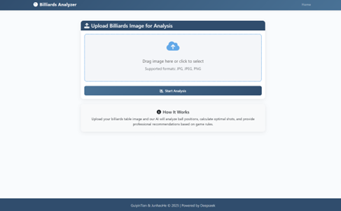

# Billiards Analysis System

An advanced computer vision system that analyzes billiards table images to provide tactical recommendations for American 9-ball games.



## Features

- Automatic detection of billiard balls, cue ball, and table pockets using YOLOv5
- Geometric analysis of possible shots and angles
- Path blocking detection between cue ball, target ball, and pockets
- AI-powered suggestions based on American 9-ball rules
- Web interface for easy interaction and result visualization
- Support for various image formats and resolutions

## Tech Stack

- **Backend**: Django, Python
- **Computer Vision**: YOLOv5, OpenCV
- **AI Analysis**: DeepSeek API
- **Frontend**: Bootstrap, JavaScript, Markdown rendering

## Installation

### Prerequisites

- Python 3.8+
- PyTorch
- CUDA-capable GPU (recommended for faster detection)

### Setup

1. Clone the repository:
   ```
   git clone https://github.com/yourusername/billiards-analysis.git
   cd billiards-analysis
   ```

2. Create a virtual environment and activate it:
   ```
   python -m venv venv
   source venv/bin/activate  # On Windows: venv\Scripts\activate
   ```

3. Install requirements:
   ```
   pip install -r requirements.txt
   ```

4. Set up the database:
   ```
   python manage.py migrate
   ```

5. Run the development server:
   ```
   python manage.py runserver
   ```

6. Access the application at http://127.0.0.1:8000/

## Usage

1. **Upload an image**: From the main page, upload a clear image of a billiards table with balls.

2. **View analysis**: The system will automatically process the image, detecting balls and pockets, then provide:
   - Visual detection results showing identified objects
   - Angle and distance analysis between balls and pockets
   - AI-generated tactical recommendations

3. **Admin panel**: Access the admin panel at /admin to reset the database or view analysis records.

## System Architecture

```
┌─────────────┐     ┌──────────────┐     ┌────────────────┐
│ Django Web  │─────▶ YOLOv5 Model │─────▶ Angle Analysis │
│ Interface   │     │ Detection    │     │ & Path Finding │
└─────────────┘     └──────────────┘     └────────────────┘
       │                                          │
       │                                          ▼
       │                                 ┌────────────────┐
       └─────────────────────────────────▶ DeepSeek AI   │
                                         │ Recommendations│
                                         └────────────────┘
```

## Project Structure

- `Billiards_Analysis/` - Django project directory
  - `analysis_app/` - Main application code
    - `models.py` - Database models for storing images and results
    - `views.py` - Logic for processing uploads and displaying results
    - `templates/` - HTML templates
- `yolov5/` - YOLOv5 object detection model
- `promptFromGPT.py` - Geometric analysis of ball positions
- `Deepseek.py` - AI-powered tactical analysis

## Configuration

API keys and other settings can be configured in the environment variables or directly in the relevant files:

- DeepSeek API key in `Deepseek.py`
- Detection model configuration in `yolov5/detectbilliards.py`

## License

This project is licensed under the MIT License - see the LICENSE file for details.

## Acknowledgments

- YOLO model by Ultralytics
- DeepSeek API for tactical analysis

## Contributing

Contributions are welcome! Please feel free to submit a Pull Request.
