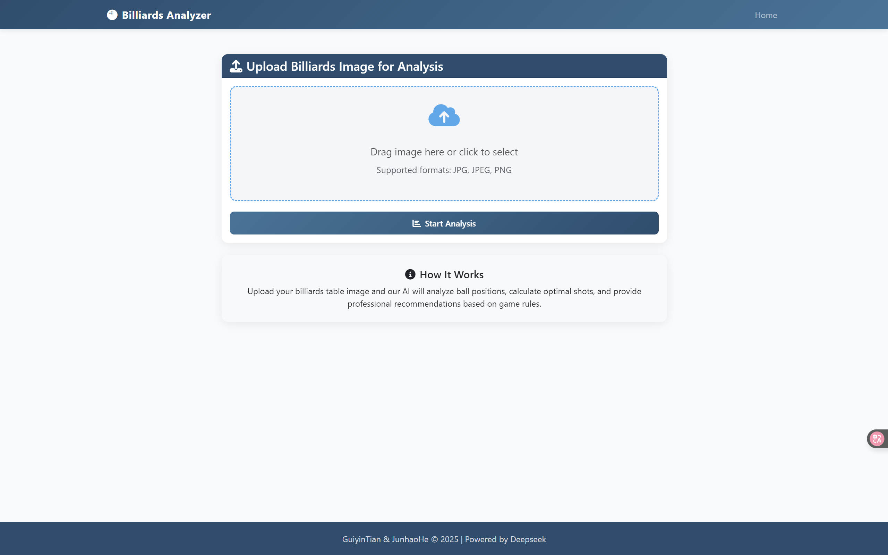

# Billiards Analyzer

A web application that utilizes Yolov5 and LLM to analyze images of billiards tables, providing tactical recommendations for American 9-ball games.

<div style="text-align: center;">
    
</div>

## Features

- Automatic detection of billiard balls, cue ball, and table pockets using YOLOv5
- Geometric analysis of possible shots and angles
- Path blocking detection between cue ball, target ball, and pockets
- AI-powered suggestions based on American 9-ball rules
- Web interface for easy interaction and result visualization
- Support for various image formats and resolutions

## Tech Stack

- **Backend**: Django, Python
- **Computer Vision**: YOLOv5, OpenCV
- **AI Analysis**: DeepSeek API
- **Frontend**: Bootstrap, JavaScript, Markdown rendering

## Project Structure

- `Billiards_Analysis/` - Django project directory
  - `analysis_app/` - Main application code
    - `models.py` - Database models for storing images and results
    - `views.py` - Logic for processing uploads and displaying results
    - `templates/` - HTML templates
- `yolov5/` - YOLOv5 object detection model
- `script/` - Analysis scripts
  - `promptFromGPT.py` - Geometric analysis of ball positions
  - `Deepseek.py` - AI-powered tactical analysis with LLM
- `NineBallPocketNoNine/weights/` - Directory for model weights

## Installation

### Prerequisites

- Python 3.8+
- PyTorch
- CUDA-capable GPU (recommended for faster detection)
- **DeepSeek API Key** (required for tactical analysis)

### Setup

1. Clone the repository:
   ```
   git clone https://github.com/GuiyinTIAN/Billiards-Analyzer.git
   ```

2. Create a virtual environment and activate it:
   ```
   python -m venv venv
   source venv/bin/activate  # On Windows: venv\Scripts\activate
   ```
   or
   ```
   conda create -n billiards-env
   conda activate billiards-env
   ```

3. Install requirements:
   ```
   # if not in the project directory, navigate to it first
   cd Billiards_Analyzer
   pip install -r requirements.txt
   ```

4. Back to project directory, Install YOLOv5 as a local package:
   ```
   cd yolov5
   pip install .
   cd ..
   ```

5. Prepare weight files if want to use a custom model:
   - Place the model weight files (`best.pt` or `last.pt`) in the following directory:
     ```
     Billiards_Analyzer/NineBallPocketNoNine/weights/
     ```
   - The system will prioritize `last.pt`, and if it does not exist, it will use `best.pt`.

6. **Configure DeepSeek API**:
   - Sign up at [DeepSeek](https://deepseek.com/) to obtain an API key
   - Open the file `script/Deepseek.py` and replace `<YOUR_API_KEY>` with your actual DeepSeek API key:
     ```python
     APIKEY = "your_deepseek_api_key_here"
     ```
   - Without a valid API key, the system will only perform visual detection without tactical analysis

7. Set up the database:
   ```
   cd Billiards_Analysis
   python manage.py migrate
   ```

8. Run the development server:
   ```
   python manage.py runserver
   ```

9. Access the application: http://127.0.0.1:8000/

### About the `pip install .` Command

`pip install .` command will:
- Install the current directory as a Python package
- Automatically resolve and install all dependencies
- Allow direct module imports from anywhere in the project without path concerns
- Ensure YOLOv5 can correctly load all its components

This command is necessary for YOLOv5 to work properly, as it allows the system to call the detection module from any location.

## Usage

1. **Upload an image**: From the main page, upload a clear image of a billiards table with balls.

2. **View analysis**: The system will automatically process the image, detecting balls and pockets, then provide:
   - Visual detection results showing identified objects
   - Angle and distance analysis between balls and pockets
   - AI-generated tactical recommendations

3. **Admin panel**: Access the admin panel at /admin to reset the database or view analysis records.

## System Architecture

```
┌─────────────┐     ┌──────────────┐     ┌────────────────┐
│ Django Web  │─────▶ YOLOv5 Model │─────▶ Angle Analysis │
│ Interface   │     │ Detection    │     │ & Path Finding │
└─────────────┘     └──────────────┘     └────────────────┘
       │                                          │
       │                                          ▼
       │                                 ┌────────────────┐
       └─────────────────────────────────▶ DeepSeek AI   │
                                         │ Recommendations│
                                         └────────────────┘
```


## Configuration

API keys and other settings can be configured in the environment variables or directly in the relevant files:

- DeepSeek API key in `script/Deepseek.py` (required for tactical recommendations)
- Detection model configuration in `yolov5/detectbilliards.py`
- Weight file locations in `NineBallPocketNoNine/weights/`

## License

This project is licensed under the MIT License - see the LICENSE file for details.

## Acknowledgments

- YOLO model by Ultralytics
- DeepSeek API for tactical analysis

## Contributing

Contributions are welcome! Please feel free to submit a Pull Request.
