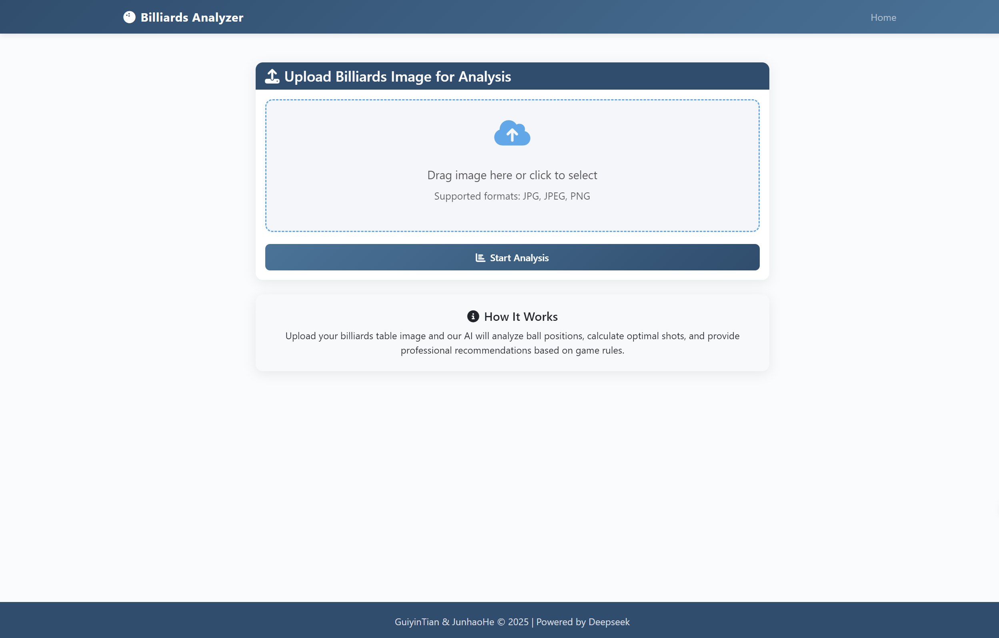

<h1 align="center">🎱 Billiards Analyzer</h1>

<p align="center">
  <b>A modern web app for billiards table analysis and tactical recommendations powered by YOLOv5 and LLM</b>
</p>

<p align="center">
  
  
  
  
  
</p>

<p align="center">
  
</p>


---

## ✨ Features

- 🎯 Automatic detection of billiard balls, cue ball, and table pockets (YOLOv5)
- 📐 Geometric analysis of possible shots and angles
- 🚧 Path blocking detection between cue ball, target ball, and pockets
- 🤖 AI-powered tactical suggestions for American 9-ball
- 🖥️ Modern web interface for easy interaction and visualization
- 🖼️ Supports various image formats and resolutions

## 🛠️ Tech Stack

| Backend        | Computer Vision      | AI Analysis   | Frontend                |
|:--------------:|:-------------------:|:-------------:|:-----------------------:|
| Django, Python | YOLOv5, OpenCV      | DeepSeek API  | Bootstrap, JS, Markdown |

## 📁 Project Structure

```text
Billiards_Analysis/         # Django project root
  └─ analysis_app/          # Main app
      ├─ models.py          # Database models
      ├─ views.py           # Upload & result logic
      └─ templates/         # HTML templates
script/                    # Analysis scripts
  ├─ promptFromGPT.py      # Geometric analysis
  └─ Deepseek.py           # LLM tactical analysis
NineBallPocketNoNine/weights/ # Model weights
yolov5/                    # YOLOv5 detection model
```

## 🚀 Quick Start

### Prerequisites

- Python 3.8+
- PyTorch
- CUDA-capable GPU (recommended)
- DeepSeek API Key (for tactical analysis)

### Setup

```bash
# 1. Clone the repository
git clone https://github.com/GuiyinTIAN/Billiards-Analyzer.git

# 2. Create and activate a virtual environment
python -m venv venv && source venv/bin/activate  # Windows: venv\Scripts\activate
# or
conda create -n billiards-env && conda activate billiards-env

# 3. Install requirements
cd Billiards_Analyzer
pip install -r requirements.txt

# 4. Install YOLOv5 as a local package
cd yolov5
pip install .
cd ..

# 5. Place model weights (best.pt or last.pt)
#   Billiards_Analyzer/NineBallPocketNoNine/weights/

# 6. Configure DeepSeek API
#   Edit script/Deepseek.py and set your API key:
#   APIKEY = "your_deepseek_api_key_here"

# 7. Initialize the database
cd Billiards_Analysis
python manage.py migrate

# 8. Run the development server
python manage.py runserver

# 9. Access: http://127.0.0.1:8000/
```

> 💡 `pip install .` makes YOLOv5 available as a package for import anywhere in the project.

## 🕹️ Usage

1. **Upload an image**: Upload a clear image of a billiards table from the main page.
2. **View analysis**: The system detects balls and pockets, analyzes geometry, and provides AI tactical suggestions.
3. **Admin panel**: Visit `/admin` to reset the database or view analysis records.

## ⚙️ Configuration

- DeepSeek API key: `script/Deepseek.py`
- Detection model config: `yolov5/detectbilliards.py`
- Model weights: `NineBallPocketNoNine/weights/`

## 📄 License

MIT License. See the LICENSE file for details.

## 🙏 Acknowledgments

- YOLOv5 by Ultralytics
- DeepSeek API

## 🤝 Contributing

Contributions are welcome! Please submit a Pull Request.
